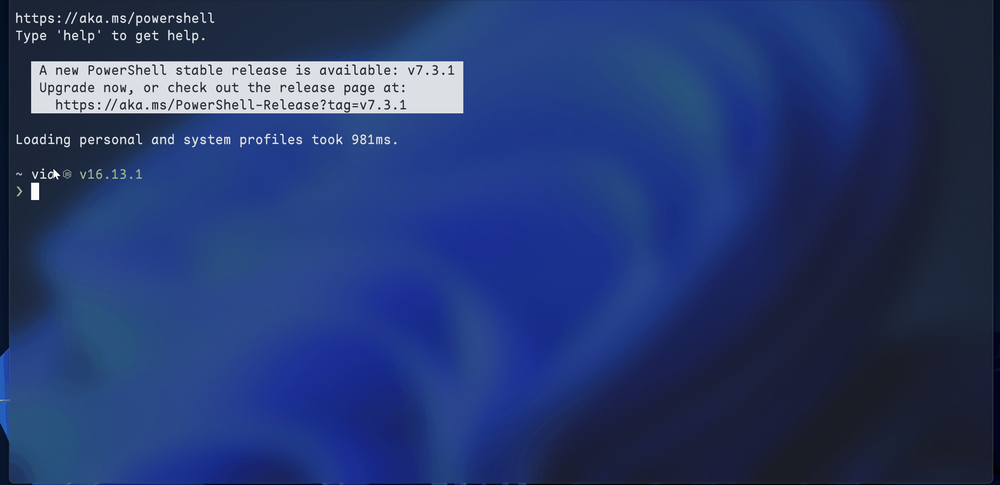

<h1 align=center>
dotfiles
</h1>

> Organize my dotfiles with ln command; and sync them with git.

## :gear:Setup

### PowerShell Config

- lookup the powershell version `$PSVersionTable`
- Install powershell 7
- `mkdir ~/Document/PowerShell`(📎some version maybe in ~/Documents/WindowsPowerShell, you can `echo $profile`)
- Install [scoop](https://scoop.sh/)
- Install [StarShip](https://github.com/starship/starship) `scoop install starship`
- Install :link:[PSReadline](https://github.com/PowerShell/PSReadLine) **(No need for powershell 7, for it has been built default)** click the link and look the readme
- Install module [write-big-char](https://github.com/ACupofAir/Write-Big-Char): `Install-Module -Name Write-Big-Char`
- Install module [directory-stack](https://github.com/ACupofAir/Directory-Stack): `Install-Module -Name directory-stack`
- `ln -s xxx/dotfile/Microsoft.PowerShell_profile.ps1 $profile`

### Zsh Config `zshrc`

- Clone this repository to your own machine
- `ln -s thisFoldPosition ~/.zshrc`
- You should change the proxy ip and port in my zshrc

### Vim Config `vimrc`
* 🥳Highlight: 
    * It is **completely offline**.
    * Tabline support.
* Usage: Just replace this `vimrc` to ~/.vimrc: `cat vimrc > ~/.vimrc`


### Neovim Config `init.lua`

> `init_offline.lua` is the offline version of user/init.lua

- On windows :window: with :link:[lazyvim](https://www.lazyvim.org/), follow the official tutor to install lazyvim, or use my conifguration following

1. Make a backup of your current Neovim files:

```powershell
Move-Item $env:LOCALAPPDATA\nvim $env:LOCALAPPDATA\nvim.bak

# optional but recommended
Move-Item $env:LOCALAPPDATA\nvim-data $env:LOCALAPPDATA\nvim-data.bak
```

2. Clone my conifguration

```powershell
git clone git@github.com:ACupofAir/lazyvim_config.git $env:LOCALAPPDATA\nvim
```

3. Remove the .git folder, so you can add it to your own repo later

```powershell
Remove-Item $env:LOCALAPPDATA\nvim\.git -Recurse -Force
```

4. Need to rely on other components

- im-select

```bash
scoop bucket add im-select https://github.com/daipeihust/im-select
scoop install im-select
```

- gcc

```bash
scoop install gcc
```

- a nerd font: open this [website](https://www.nerdfonts.com/), choose anyone your liked

5. Start Neovim! `nvim`

## :toolbox:Usage

### PowerShell

- Directors Stack Function (no need install other plugins)
  
  - `pd`: pushd the current directory into stack
  - `pd $dir_name`: pushd the directory named `$dir_name` into stack
  - `dv`: show the directory in stack(dv is the alias from `dirs -v` on linux)
  - `pd $index`: switch to the directory in stack whose index is `$index`
  - `pp $index`: popd the directory whose index is `$index` from stack
- Proxy Usage
  - `pxon`: set proxy
  - `pxoff`: clear proxy
  - `Set-Git-Proxy`: set git proxy
- Historys
  - need install [PSReadline](https://github.com/PowerShell/PSReadLine)
  - `historys` will show all powershell command history
- Translator
  - need install python and [google-translate-for-goldendict](https://github.com/xinebf/google-translate-for-goldendict)
  - `trans $text` will translate `$text` to English or Chinese
- Draw String Bigger
  
  - `draw $TEXT`: draw `$TEXT` bigger on powershell

## :warning:note

- Should use full path `ln -s $fullpath/dotfile/xxx $fullpath/xxx`
- Should use `sudo` prefix
